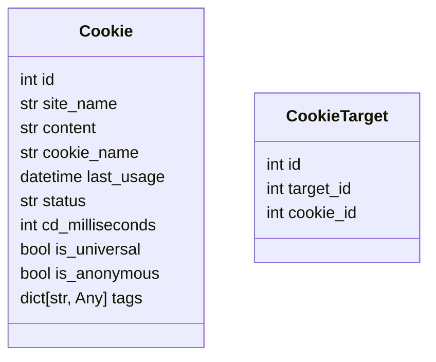

<br><br><br>

<center><p style="font-size:56px"><b>结项报告</b></p></center>

<br>

<center>项目名称：<u>bison 爬虫的 Cookie 管理与调度系统</u></center>

<center>项目主导师：<u><a href="mailto:felinae225@qq.com ">felinae98</a></u></center>

<center>申请人：<u>杜家楷</u></center>

<center>日期：<u>2024.05.29</u></center>

<center>邮箱：<u>suyiiyii@gmail.com</u></center>

[toc]

### 方案描述：

继承原有的 ClientManager，创建 CookieClientManger，在获取 client 时，会根据 Target 信息自动选择合适的 Cookie。

### cookie存储

因为Cookie和订阅的Target之间是多对多关系，所以创建两张表，一张cookie表用于存储cookie的内容和状态等信息，另一张是CookieTarget表，用于存储cookie和target直接的关系。



### 获取 Cookie

```python
async def get_client(self, target: Target | None) -> AsyncClient: ...

async def get_client_for_static(self) -> AsyncClient: ...

async def get_query_name_client(self) -> AsyncClient: ...

async def refresh_client(self): ...
```

目前的 ClientManager 有以上方法，Platform 模块抓取时，用的是get_client方法，获取到AsyncClient，再使用获取到的AsyncClient进行请求。所以，只需要重写get_client方法，根据传入的Target信息返回带有cookie的client，即可实现携带Cookie请求。

### 调度 Cookie

首先，cookie分为实名Cookie和匿名Cookie。实名cookie为用户上传的cookie，匿名cookie为程序可以自动生成的cookie。

同时，项目内还存在没有target概念的Platform，还需要兼容这种情况。

为了调度Cookie，添加了`status` 、`last_usage`、 `cd`、 `is_anonymous` 等字段，具体定义和含义见下：

```python
    # 最后使用的时刻
    last_usage: Mapped[datetime.datetime] = mapped_column(DateTime, default=datetime.datetime(1970, 1, 1))
    # Cookie 当前的状态
    status: Mapped[str] = mapped_column(String(20), default="")
    # 使用一次之后，需要的冷却时间
    cd_milliseconds: Mapped[int] = mapped_column(default=0)
    # 是否是通用 Cookie（对所有Target都有效）
    is_universal: Mapped[bool] = mapped_column(default=False)
    # 是否是匿名 Cookie
    is_anonymous: Mapped[bool] = mapped_column(default=False)
    # 标签，扩展用
    tags: Mapped[dict[str, Any]] = mapped_column(JSON().with_variant(JSONB, "postgresql"), default={})
```

其中：

- **is_universal**：用于标记Cookie是否为通用Cookie，即对所有Target都有效。可以理解为是一种特殊的target，添加Cookie和获取Cookie时通过传入参数进行设置。

- **is_anonymous**：用于标记Cookie是否为匿名Cookie，目前的定义是：可以由程序自动生成的，适用于所有target的Cookie。目前的逻辑是bison启动时，删除原有的匿名cookie，再生成一个新的匿名cookie。

- **无 Target 平台的 Cookie 处理方式**

  对于不存在 Target 的平台，如小刻食堂，可以重写 init_cookie 方法，为用户 cookie 设置 is_universal 属性。这样，在获取 Client 时，由于传入的 Target 为空，就只会选择 is_universal 的 cookie。实现了无 Target 平台的用户 cookie 调度。

### 选择cookie

#### 一种基于优先队列的Cookie选择算法

只是简单的选择。

设定：

- Cookie的「空闲时间」定义为从上次被选择到现在，经过的时间
- 每一个Cookie有一个独立的CD，每次使用之后必须间隔一定时间后才能够再次使用
- 匿名Cookie作为保底，设置比实名Cookie短的CD

实现思路

- 在每次Cookie被选择时，记录此时的时间
- 每次选择时，选择空闲时间最长的Cookie，并检查是否过了CD，如果还在冷却，则选择下一个Cookie，否则选择该Cookie
- 如果没有可用的Cookie，则跳过本次选择

### 时间规划：

#### 调研和熟悉阶段（07 月 01 日 - 08 月 01 日）

- [x] 调研主流平台 Cookie 使用情况
- [x] 详细阅读代码，跟踪调试，熟悉项目细节
- [x] 编写自己的测试平台类，便于做集成测试
- [x] 整理开发方案，提交社区讨论

#### 开发阶段（08 月 01 日 - 09 月 01 日）

- [x] 和社区共同讨论，确定开发方案
- [x] 编写核心功能模块
- [x] 添加相关组件的单元测试

#### 整理和收尾阶段（09 月 01 日 - 09 月 30 日）

- [x] 和社区一起验收核心功能模块
- [x] 完善相关文档
- [x] 思考可以改进或者补充的地方

## 项目总结

- 已完成工作：

  - 完成CookieClientManger
  - 创建存储 Cookie 的数据表，支持CookieClientManger选择Cookie。
  - 为管理员管理Cookie创建对话交互
  - 在原有的 WebUI 上添加管理Cookie功能
  - 导入导出功能支持Cookie

- 测试用例：

  按照项目开发规范编写单元测试，覆盖率不下降，不低于85%。

- 后续工作安排：

  目前，项目的功能已经开发完毕，已提交PR。但由于个人和社区的时间分配问题，PR的review工作还在进行中，所以接下来的时间将会和社区成员一起修改PR，达到社区的要求后合并。

## 心得体会

起初，我是在学校里师兄的推荐下，了解到开源之夏活动。我自己很早就了解到开源，也想要参与开源，但是一直没有好的途径，非常感谢活动的组织方提供了这样一个机会让我接触开源，参与开源。

我们的项目主要编程语言是Python，在以往，我只会用Python写一些自用的脚本，最多就是一下简单的REST API后端，都是大家口中的「玩具」。而参与此次项目，才让我了解到一个真正有产品，有用户的开源项目是怎么运行的。Release、Issue、PR&Review，还有大家在一起讨论，这都是我做自己的项目体验不到的。

同时，参与此次项目也极大的提高了我的代码能力，`装饰器`，`元类`，`类型参数`等高级用法，都是我之前没有接触过或接触过但仅限于使用的。还有单元测试，单元测试我一直想做，但是总是遇到些解决不了的问题就放弃了，项目中大量的单元测试，我可以照着已有的去写我自己的，在这个过程中我学到了很多。还有，项目惜字如金的码风，也极大的提高了我阅读缺少注释的代码的能力。

这在里，要感谢社区的成员们，愿意回答我这个新人的各种问题，给我的代码和报告提建议，群友直接还有时不时的互动，给我家的感觉。

还要特别感谢我的导师（felinae98），像一个家长一样，~~及时的~~详尽的review我的代码，通过引导让我自己意识到我的方案存在什么问题，并提供改进方案。对于我和社区提出的一些自己觉得很合理的方案，详细的给我们分析项目的情况和引入之后导致的复杂度，以及引入的必要性。我在后来更加深刻的理解项目之后才意识到，当时提出的方案是一个过度设计，也更加认可导师的观点。

TODO：个人反思与展望
