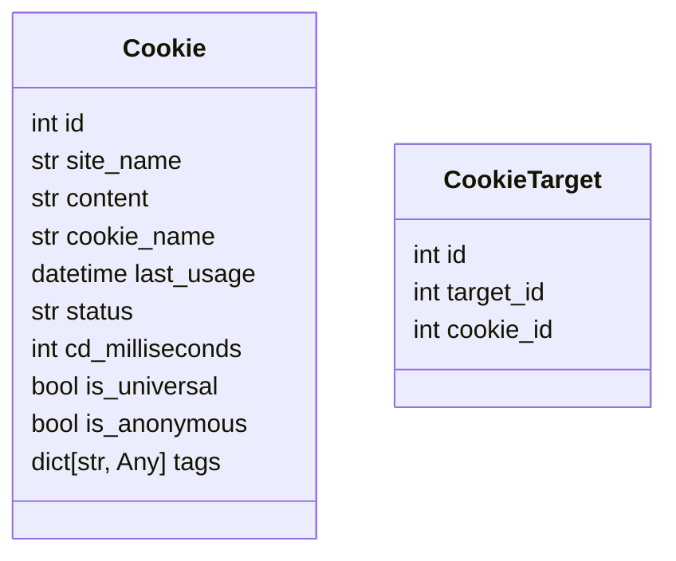

<br><br><br>

<center><p style="font-size:56px"><b>结项报告</b></p></center>

<br>

<center>项目名称：<u>bison 爬虫的 Cookie 管理与调度系统</u></center>

<center>项目主导师：<u><a href="mailto:felinae225@qq.com ">felinae98</a></u></center>

<center>报告人：<u>杜家楷</u></center>

<center>日期：<u>2024.09.30</u></center>

<center>邮箱：<u>suyiiyii@gmail.com</u></center>

[toc]

# 项目背景

Bison 是一个支持从各个站点和社交平台获取信息，并推送到 QQ 的 NoneBot 插件。但是随着从各个网站获取信息难得的提升，Bison 需要支持携带 Cookie 进行请求。

本项目旨在为 Bison 添加 Cookie 功能的支持。完成一个通用的 Cookie 组件，为各个平台的信息采集提供支持并保证扩展能力，需要同时支持实名 Cookie 和匿名 Cookie 的调度；同时要实现完善的 UI 供管理员进行管理。

# 方案描述：

继承原有的 ClientManager，创建 CookieClientManger，在获取 client 时，会根据 Target 信息自动选择合适的 Cookie。

## cookie 存储

因为 Cookie 和订阅的 Target 之间是多对多关系，所以创建两张表，一张 Cookie 表用于存储 Cookie 的内容和状态等信息，另一张是 CookieTarget 表，用于存储 Cookie 和 target 直接的关系。



## 获取 Cookie

```python
async def get_client(self, target: Target | None) -> AsyncClient: ...

async def get_client_for_static(self) -> AsyncClient: ...

async def get_query_name_client(self) -> AsyncClient: ...

async def refresh_client(self): ...
```

现有的 ClientManager 有以上方法，Platform 模块抓取时，用的是 get_client 方法，获取到 AsyncClient，再使用获取到的 AsyncClient 进行请求。所以，只需要重写 get_client 方法，根据传入的 Target 信息返回带有 Cookie 的 client，即可实现携带 Cookie 请求。

## 调度 Cookie

首先，cookie 分为实名 Cookie 和匿名 Cookie。实名 Cookie 为用户上传的 cookie，匿名 Cookie 为程序可以自动生成的 cookie。

同时，项目内还存在没有 target 概念的 Platform，还需要兼容这种情况。

为了调度 Cookie，添加了`status` 、`last_usage`、 `cd`、 `is_anonymous` 等字段，具体定义和含义见下：

```python
    # 最后使用的时刻
    last_usage: Mapped[datetime.datetime] = mapped_column(DateTime, default=datetime.datetime(1970, 1, 1))
    # Cookie 当前的状态
    status: Mapped[str] = mapped_column(String(20), default="")
    # 使用一次之后，需要的冷却时间
    cd_milliseconds: Mapped[int] = mapped_column(default=0)
    # 是否是通用 Cookie（对所有 Target 都有效）
    is_universal: Mapped[bool] = mapped_column(default=False)
    # 是否是匿名 Cookie
    is_anonymous: Mapped[bool] = mapped_column(default=False)
    # 标签，扩展用
    tags: Mapped[dict[str, Any]] = mapped_column(JSON().with_variant(JSONB, "postgresql"), default={})
```

其中：

- **is_universal**：用于标记 Cookie 是否为通用 Cookie，即对所有 Target 都有效。可以理解为是一种特殊的 target，添加 Cookie 和获取 Cookie 时通过传入参数进行设置。

- **is_anonymous**：用于标记 Cookie 是否为匿名 Cookie，目前的定义是：可以由程序自动生成的，适用于所有 target 的 Cookie。目前的逻辑是 bison 启动时，删除原有的匿名 cookie，再生成一个新的匿名 cookie。

- **无 Target 平台的 Cookie 处理方式**

  对于不存在 Target 的平台，如小刻食堂，可以重写 init_cookie 方法，为用户 Cookie 设置 is_universal 属性。这样，在获取 Client 时，由于传入的 Target 为空，就只会选择 is_universal 的 cookie。实现了无 Target 平台的用户 Cookie 调度。

## 选择 cookie

### 一种基于优先队列的 Cookie 选择算法

只是简单的选择。

设定：

- Cookie 的「空闲时间」定义为从上次被选择到现在，经过的时间
- 每一个 Cookie 有一个独立的 CD，每次使用之后必须间隔一定时间后才能够再次使用
- 匿名 Cookie 作为保底，设置比实名 Cookie 短的 CD

实现思路

- 在每次 Cookie 被选择时，记录此时的时间
- 每次选择时，选择空闲时间最长的 Cookie，并检查是否过了 CD，如果还在冷却，则选择下一个 Cookie，否则选择该 Cookie
- 如果没有可用的 Cookie，则跳过本次选择

# 时间规划：

## 调研和熟悉阶段（07 月 01 日 - 08 月 01 日）

- [x] 调研主流平台 Cookie 使用情况
- [x] 详细阅读代码，跟踪调试，熟悉项目细节
- [x] 整理开发方案，提交社区讨论

## 开发阶段（08 月 01 日 - 09 月 01 日）

- [x] 和社区共同讨论，确定开发方案
- [x] 编写核心功能模块
- [x] 添加相关组件的单元测试

## 整理和收尾阶段（09 月 01 日 - 09 月 30 日）

- [x] 和社区一起验收核心功能模块
- [x] 完善相关文档
- [x] 思考可以改进或者补充的地方

# 效果展示

## 使用对话添加 Cookie


## 使用对话关联 Cookie 到 Target


在此之后，Bison 会携带用户上传的 Cookie 进行请求，可以抓取到受限制的内容，比如说仅粉丝可见的消息


## 删除 Cookie


## Web UI

在 Bison 原有 Web UI 的基础上，添加了管理 Cookie 的功能。


# 项目难点

我认为项目的难点主要在 Cookie 的调度上。

## 调度基础

因为项目支持多个用户同时使用，每个用户都支持订阅不同的平台，项目对订阅的管理方式并不是简单的租户之间隔离，而是共用一套调度器。例如，如果用户A和用户B同时订阅了一个Target ，此Target并不会重复采集，而是采集之后同时发送给用户A和用户B。因此，在引入Cookie之后，如果只有一个用户上传了Cookie，那么使用该Cookie采集到的信息，是否要转发给另一个用户？

经过和社区讨论，答案是：要转发。在此基础上我的解决方案是，全局仍然共用调度器，采取原有的调度逻辑。但是实际请求前，获取AsyncClient时，会根据请求的Target选择合适的Cookie。

同时，一个实名Cookie可以访问多个受限的资源（例如一个账号可以关注多个微博用户），一个受限的资源也可以通过多个实名Cookie去访问。因此需要合理的对Cookie进行建模。

我抽象了Cookie和CookieTarget两种对象，前者存储Cookie数据，后者存储Cookie和Target的关系，来处理Cookie和Target之间的多对多关系。

## 实名Cookie和匿名Cookie

实名Cookie指的是用户上传的Cookie，匿名Cookie指的是程序能够自己生成的Cookie。Bison 原来只有匿名Cookie，当匿名Cookie失效之后，会尝试重新生成Cookie，基本无额外成本。而如果使用实名Cookie，频繁请求可能会使Cookie关联的用户有安全风险，因此需要指定合理的请求策略。

我将实名Cookie和匿名Cookie进行统一管理，使用同样的调度逻辑进行处理，但是匿名Cookie将会有与实名Cookie不同的参数。让两者在同一个框架下实现了统一调度。

## 无目标概念的平台

Bison还支持采集公告、博客类的，没有「目标」概念的站点（有目标概念的站点有微博，B站等）。对于此类平台，添加Cookie之后，无需关联到Target，也可以说只有该平台一个Target。

对此，我给Cookie添加了`is_universal`属性，用来表示该Cookie是否适用于平台的所有Target，调度时默认在选择范围内。也为匿名Cookie的实现提供支持。

## Cookie 调度

为了实现在安全范围内尽可能快速采集的要求，我设计了默认的调度策略。

- 选择所有匹配的Cookie（包括有关联的和`is_universal`的）
- 在匹配的Cookie集合中，选择满足`last_usage + cd < now()`且`last_usage`值最小的Cookie

这样做，可以以一种简单的方式实现对实名Cookie的选择，同时提供匿名Cookie为备用方案。

同时，在编写Cookie模块时，我把调度Cookie中的各个阶段都使用函数抽象出来，如选择Cookie、组装Client、状态回写等，便于适配平台的个性化需求。

# 项目总结

- 已完成工作：

  - 完成 CookieClientManger
  - 创建存储 Cookie 的数据表，支持 CookieClientManger 选择 Cookie。
  - 为管理员管理 Cookie 创建对话交互
  - 在原有的 WebUI 上添加管理 Cookie 功能
  - 导入导出功能支持 Cookie

- 测试用例：

  按照项目开发规范编写单元测试，覆盖率不下降，不低于 85%。

- 后续工作安排：

  目前，项目的功能已经开发完毕，已提交 PR。但由于个人和社区的时间分配问题，PR 的 review 工作还在进行中，所以接下来的时间将会和社区成员一起修改 PR，达到社区的要求后合并。

# 心得体会

起初，我是在学校里师兄的推荐下，了解到开源之夏活动。我自己很早就了解到开源，也想要参与开源，但是一直没有好的途径，非常感谢活动的组织方提供了这样一个机会让我接触开源，参与开源。

我们的项目主要编程语言是 Python，在以往，我只会用 Python 写一些自用的脚本，最多就是一下简单的 REST API 后端，都是大家口中的「玩具」。而参与此次项目，才让我了解到一个真正有产品，有用户的开源项目是怎么运行的。Release、Issue、PR&Review，还有大家在一起讨论交流，这都是我做自己的项目体验不到的。

同时，参与此次项目也极大的提高了我的代码能力，`装饰器`，`元类`，`类型参数`等高级用法，都是我之前没有接触过或接触过但仅限于使用的。还有单元测试，单元测试我一直想做，但是总是遇到些解决不了的问题就放弃了，项目中大量的单元测试，我可以照着已有的去写我自己的，在这个过程中我学到了很多。还有，项目惜字如金的码风，也极大的提高了我阅读缺少注释的代码的能力。

这在里，要感谢社区的成员们，愿意回答我这个新人的各种问题，给我的代码和报告提建议，群友直接还有时不时的互动，给我家的感觉。

还要特别感谢我的导师（felinae98），像一个家长一样，~~及时的~~详尽的 review 我的代码，通过引导让我自己意识到我的方案存在什么问题，并提供改进方案。对于我和社区提出的一些自己觉得很合理的方案，详细的给我们分析项目的情况和引入之后导致的复杂度，以及引入的必要性。我在后来更加深刻的理解项目之后才意识到，当时提出的方案是一个过度设计，也更加认可导师的观点。

非常高兴能够参与开源之夏活动。未来，我将继续热衷于开源事业，积极参与其中。
